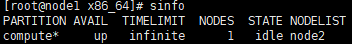
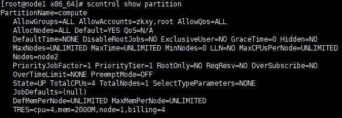
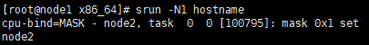
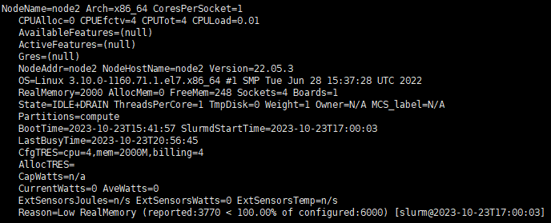

本文描述了如何搭建slurm集群！

本文[参考1](https://www.volcengine.com/docs/6419/114305)

本文[参考2](https://www.wanghaiqing.com/article/911f5d98-b68a-4daa-8db6-ee2052ec8275/)

## 实验环境
|名称|value|
|---|---|
|操作系统|CentOS7.9|
|slrum版本|22.05.3|

|主机名|IP|CPU/内存|
|---|---|---|
|node1|192.168.22.156|2/2g|
|node2|192.168.22.157|2/2g|

## slurm搭建

根据[参考1](https://www.volcengine.com/docs/6419/114305)进行`前期准备`

根据[参考2](https://www.wanghaiqing.com/article/911f5d98-b68a-4daa-8db6-ee2052ec8275/)进行`配置Munge`以及之后的操作

以下是修正步骤
1. 在`前期准备`之后要进行安装软件操作
```BASH
yum -y install net-tools wget vim ntpdate chrony htop glances nfs-utils rpcbind python3
```
2. `yum install -y rng-tools`之前需要安装epel库
```BASH
# 进行这一步之前需要进行 
yum install epel-release
yum install -y rng-tools
```

3. 在`cat >  /etc/slurm/slurm.conf << EOF`时，需要更改一下部分
```
ControlMachine=master # 主机名
ControlAddr=172.18.7.31 #主机IP

AccountingStorageHost=master # 主机名

#节点名字 以及 RealMemory（建议改小，防止之后节点实际容量不够导致错误）
NodeName=master,node[01-02] CPUs=4 RealMemory=6000 State=UNKNOWN

#计算节点的名字
PartitionName=compute Nodes=node[01-02] Default=YES MaxTime=INFINITE State=UP AllowAccounts=zkxy,root
```
4. 安装`mysql5.7`时，不能跳过防火墙的步骤
```BASH
# 如果安装的时候出现公钥尚未安装的问题
rpm --import https://repo.mysql.com/RPM-GPG-KEY-mysql-2022
```
5. 配置`slurmdbd.conf`文件时，需要修改
```
DbdAddr=172.18.7.31 #主机ip
DbdHost=master #主机名
StorageHost=172.18.0.191 #主机ip
``` 

## 搭建结果
`sinfo`<br>


`scontrol show partition`<br>


`srun -N1 hostname`<br>


## 可能出现的问题
1. `srun -N2 hostname`无法运行,其中N2的含义是，分配两个计算节点，要保证有两个可用的计算节点，可以通过`sinfo`查看，其中STATE需要是`idle`才是空闲。

2. 若`sinfo`后，计算节点的状态不是`idle`，可能是上述RealMemory=6000设置问题，可以通过执行`scontrol show node`查看，可以修改`/etc/slurm/slurm.conf`后，重启计算节点<br>
<br>
```BASH
scontrol update NodeName=node2 State=DOWN Reason="undraining"
scontrol update NodeName=node2 State=RESUME
```


